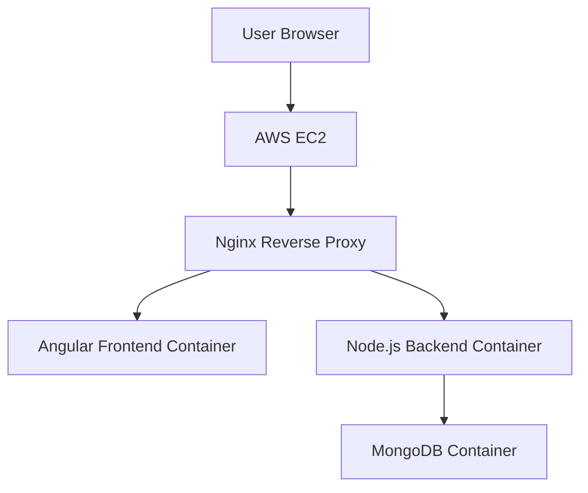

# Containerized MEAN Application with CI/CD

> About this Project :- In this project I tried to deploy a MEAN stack application using containers and automate the deployment using Jenkins CI/CD. I documented this project step by step in my notebook while building it, and this README is written based on my own understanding and notes. 

The main goal of this project was to understand how real applications are deployed in production using:

- ### Docker

- ### Docker Compose

- ### Jenkins

- ### DockerHub

- ### AWS EC2

- ### Nginx reverse proxy

>Step 1 — Creating Dockerfiles 

The first step was to containerize both parts of the application.

The application has two main components:

- ### Angular Frontend

- ### Node.js Backend

So I created two Dockerfiles, one for each.

# Frontend Dockerfile (Multi Stage Build)

For the frontend I used a multi-stage Docker build.

In the first stage I used: 

### node:20-alpine as our base image because  it is a small base image, which keeps the Docker image size smaller.

also Inside this stage I installed dependencies using:

### npm ci instead of npm install . The reason is that npm ci installs the exact dependency versions from package-lock.json, and it is also faster, which makes it more suitable for CI/CD environments.

After installing dependencies, the Angular project is built to generate the static build files.

# Serving Frontend using Nginx

In the second stage of the Dockerfile I used Nginx.

The build output from Angular is copied to:

### /usr/share/nginx/html -> Nginx then serves these files as static content.

So basically:

- ### Stage 1 → Build Angular

- ### Stage 2 → Serve files using Nginx

# Backend Dockerfile 

For the backend I created another Dockerfile which runs the Node.js Express server.

After creating the backend Dockerfile I tested the container locally to make sure that the API server was running correctly.

> Step 2 — Docker Compose

Once both containers were working individually, I created a docker-compose.yml file.

The purpose of Docker Compose is to manage multiple containers together.

In the compose file I created three services:

- ### frontend
- ### backend
- ###  mongodb

This allowed me to run the full application with a single command.

### docker compose up

> Step 3 — CI/CD Pipeline using Jenkins

After the application was running locally, the next goal was to automate the process.

So I created a Jenkins pipeline.

The pipeline performs these steps:

- ### Build Docker images

- ### Push images to DockerHub

- ### Login to EC2 server

- ### Pull latest images

- ### Start containers using docker compose

This way whenever new code is pushed, the deployment process can be automated.

# DockerHub Authentication in Jenkins :-

To push images to DockerHub from Jenkins, authentication is required.

So I created a DockerHub Personal Access Token.

Then I added it in Jenkins:

### Manage Jenkins → Credentials → Global → Add Credentials

After this, Jenkins can login to DockerHub and push images successfully.

> Step 4 — Deploying to AWS EC2

To deploy the application on EC2, I used Jenkins to connect to the server using SSH credentials.

In Jenkins credentials I added:

- ### EC2 username

- ### EC2 private key

Then inside the pipeline Jenkins can login to the EC2 instance and run deployment commands.

# Reverse Proxy using Nginx

At first, each container exposed different ports like:

- ### Frontend → 80
- ### Backend → 8081
- ### MongoDB → 27017

But exposing multiple ports is not a good practice.

So I added an Nginx reverse proxy container.

Nginx listens on port 80 and forwards requests to the correct service.

server {

    listen 80;

    location / {
        proxy_pass http://frontend:80;
    }

    location /api/ {
        proxy_pass http://backend:8081;
    }

}

Now users only access the application through port 80.

> Final Step — Running the Jenkins Pipeline

After setting up the pipeline and all credentials, the last step was simply to run the pipeline. So I went to Jenkins dashboard and created a pipeline job connected to my Git repository. 

When the pipeline starts, it performs the following tasks:

- ### Build the Docker images for frontend and backend

- ### Push those images to DockerHub

- ### Connect to the EC2 instance using SSH

- ### Pull the latest images from DockerHub

- ### Start the containers using the production docker compose file

If everything goes well, the pipeline finishes successfully.

# Verifying the Deployment
After the pipeline build is successful, I login to the EC2 instance and check the running containers.
### docker ps 
If everything is deployed correctly, I should see all the containers running:

- ### frontend
- ### backend
- ### mongodb
- ### nginx

At this point the application should be fully running inside the EC2 server. 

# Testing the Application
Finally, I open the browser and access the EC2 public IP.

 ###  http://EC2-PUBLIC-IP
 Now the request flow becomes:

### Browser → EC2 → Nginx → Frontend / Backend

If everything is configured correctly, the application loads successfully in the browser and the API calls work through the reverse proxy.

# Issue I Faced During Development

One issue I faced was related to API calls from the frontend.

Initially my frontend service was calling the backend like this:

### http://localhost:8081/api/tutorials

But this caused an error when accessing the application from the browser.

Why this happened

When a browser sees localhost, it refers to the user's own machine, not the EC2 server.

So the browser tried to find a server running on port 8081 on the user's computer, which obviously did not exist.

That is why the connection failed.

# How I Solved It
Instead of calling the backend using localhost, I changed the API path to:

### /api/tutorials

Now the request goes to the same host (EC2 IP), and Nginx forwards it to the backend container.

So the request flow becomes:

### Browser → EC2 IP → Nginx → Backend Container

After this change the issue was resolved.

